# VsCodeで図を描く（Mermaidを使用）
## ２つの拡張機能を導入する
- [MarkDown Preview Mermaid Support](https://marketplace.visualstudio.com/items?itemName=bierner.markdown-mermaid)
- [Mermaid MarkDown Syntax Highlighting](https://marketplace.visualstudio.com/items?itemName=bpruitt-goddard.mermaid-markdown-syntax-highlighting)
---
## フローチャート

---
## シーケンス図
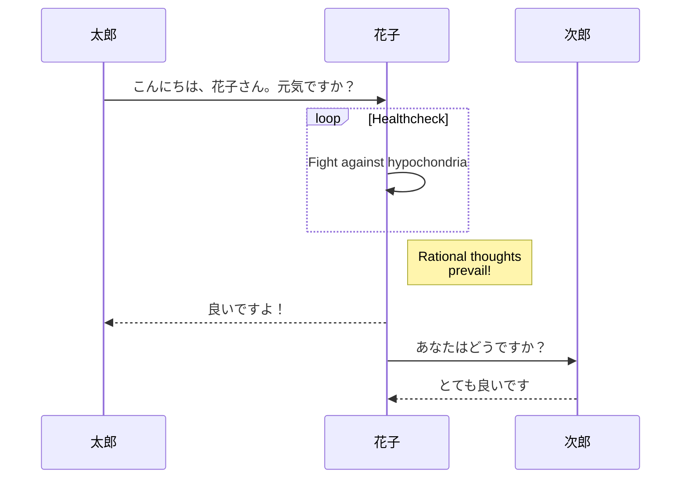
---
## ガントチャート
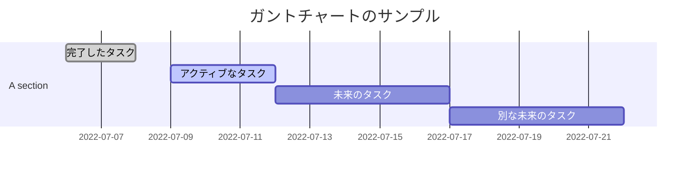
---
## クラス図
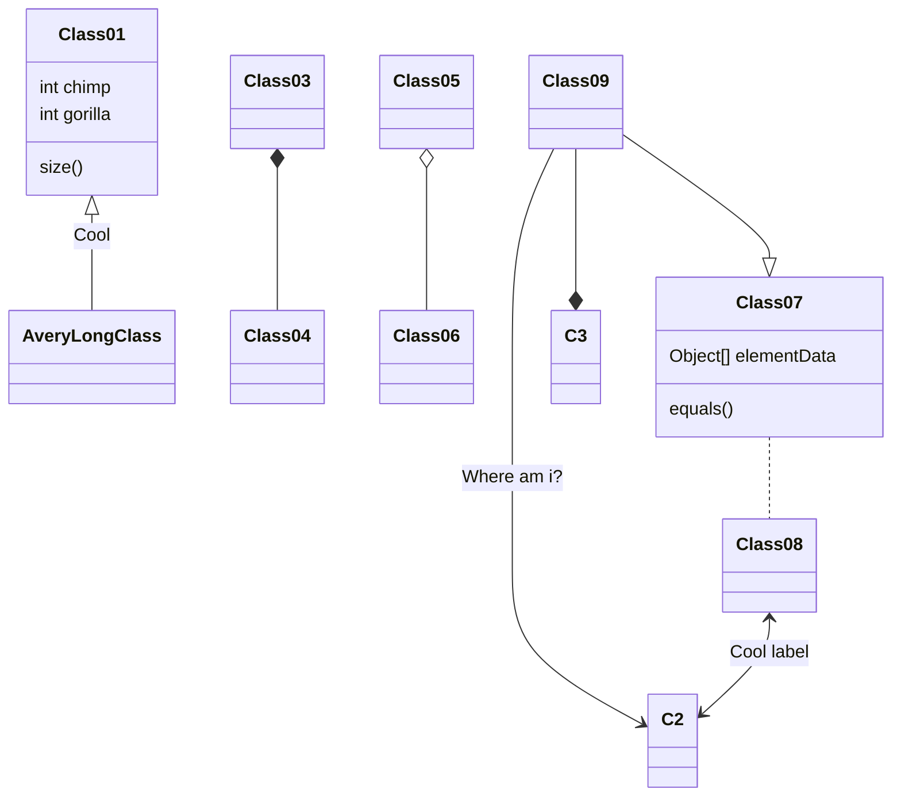
---
## Gitグラフ
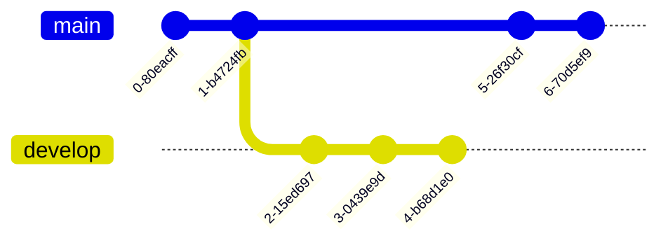
---
## ER図
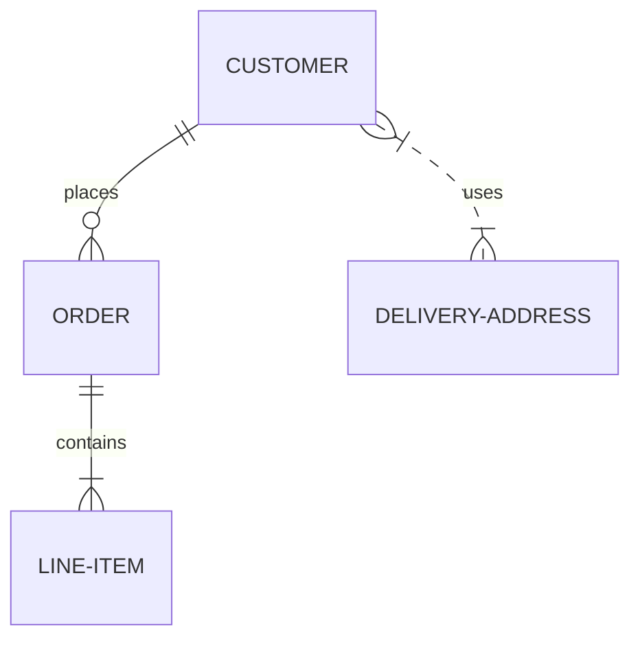
---
## ユニジャージー図
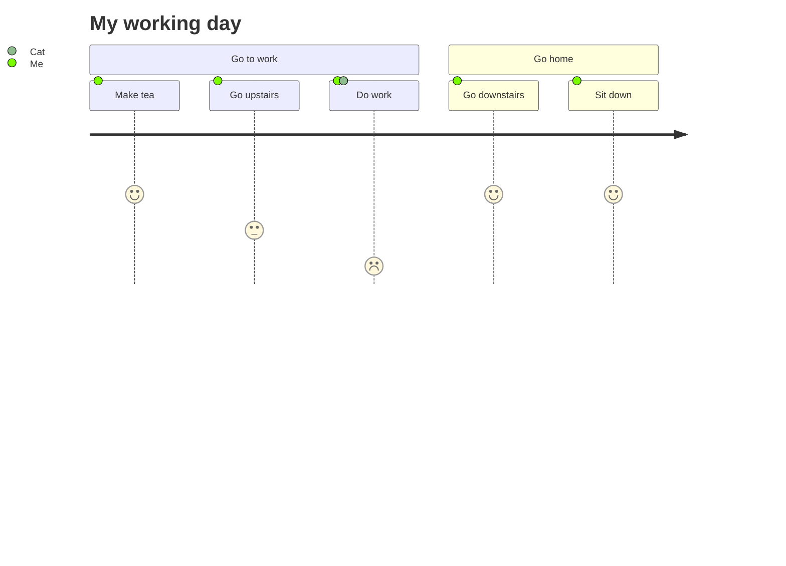
---
## ステータス図（縦）
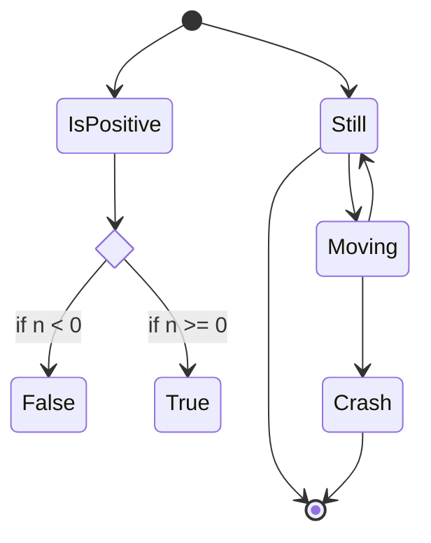
## ステータス図（横）
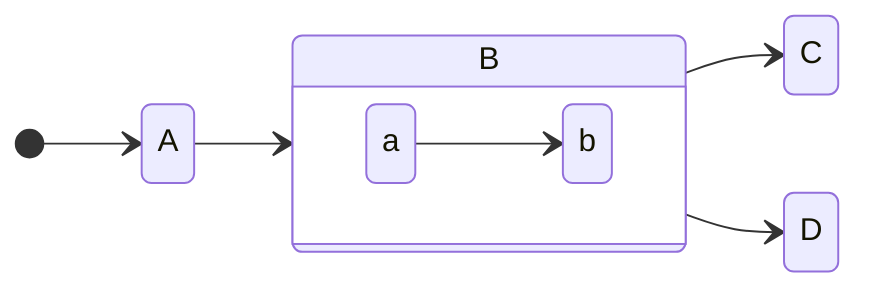
---
## 円グラフ
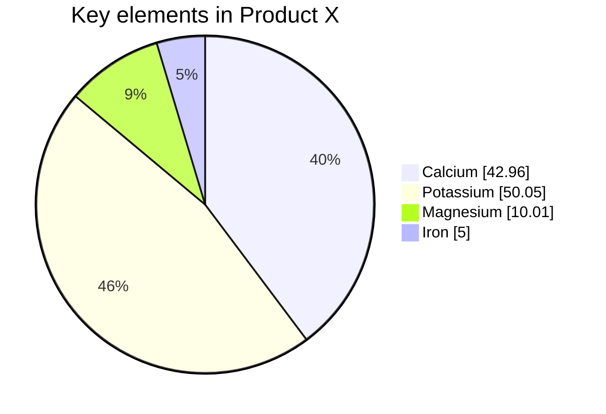
---
## 要件図
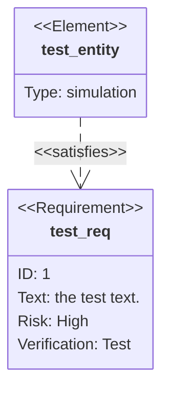
---
## XYチャート
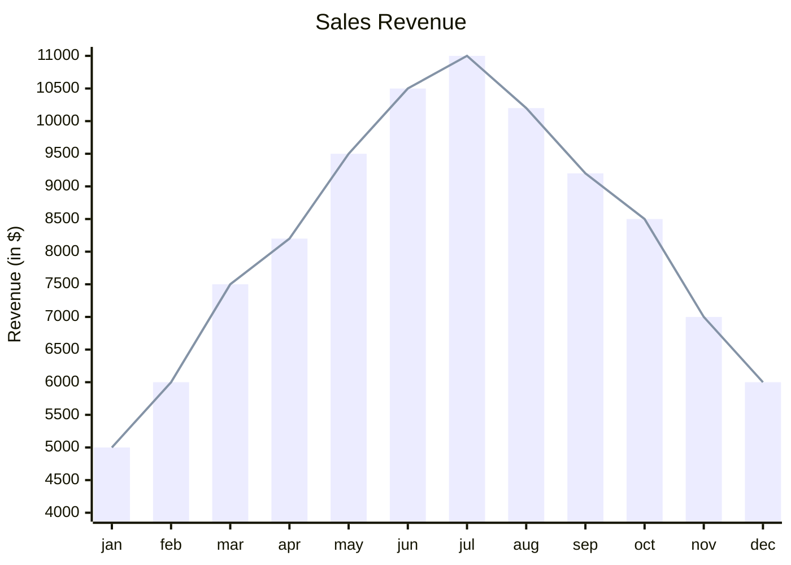
---
## 象限チャート
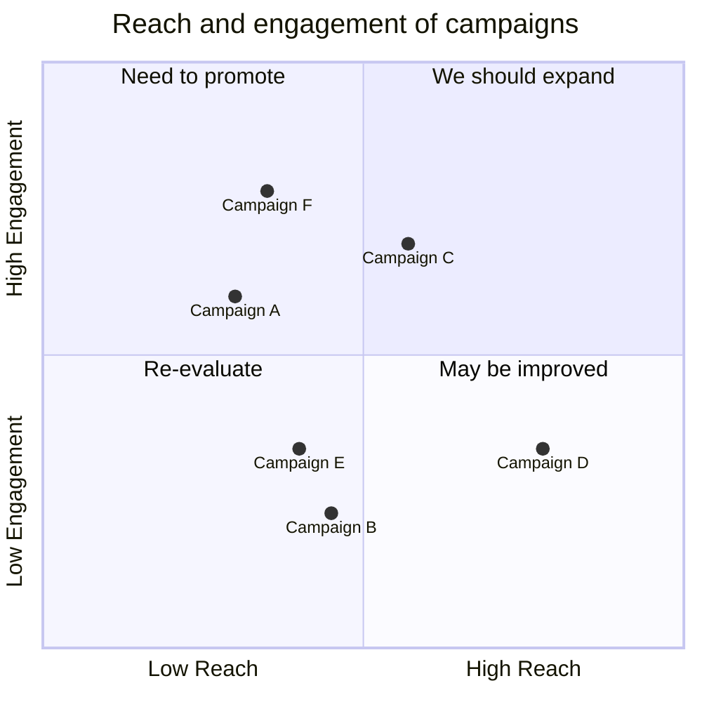
# Pythonでグラフを描く
```python {cmd=true matplotlib=true}
import numpy as np
import japanize_matplotlib
import matplotlib.pyplot as plt
japanize_matplotlib.japanize()

# 三点から係数a, b, c を求める
xx = [1,2,3]
yy = [2,5,10]

A = np.array([[xx[0]**2, xx[0], 1], [xx[1]**2, xx[1], 1], [xx[2]**2, xx[2], 1]])
b = np.array([yy[0], yy[1], yy[2]])
a,b,c = np.linalg.solve(A,b)

# グラフに描画する
x = np.linspace(0.5 ,4.5 ,100)
y = a * x**2 + b * x + c

plt.plot(x,y)
plt.plot(xx,yy,'o')
plt.title("二次関数 y=ax^2+bx+c")
plt.xlabel("x")
plt.ylabel("y")
plt.show()
```
```python {cmd=true matplotlib=true}
import numpy as np
import japanize_matplotlib
import matplotlib.pyplot as plt
japanize_matplotlib.japanize()


# 平均10、標準偏差10 の正規乱数を100件生成
x = np.random.normal(10, 10, 1000)

plt.hist(x)
# ヒストグラムを表示
plt.show()
```
```python {cmd=true matplotlib=true}
# アステロイド 曲 線 を 描 く Python の プログ ラム コード の 例

import numpy as np # numpy ライブ ラリー を インポート する
import japanize_matplotlib
import matplotlib.pyplot as plt
japanize_matplotlib.japanize()

# パラメータ の 設定
a = 1 # 楕円 の 半径
t = np.linspace(0, 2 * np.pi, 100) # 角 度 の 配列

# x 座標 と y 座標 の 配列 を 計算 する
x = a * np.cos(t) ** 3
y = a * np.sin(t) ** 3

# アステロイド 曲 線 を 描画 する
plt.plot(x, y)
plt.xlabel("x")
plt.ylabel("y")
plt.title("アステロイド曲線")
plt.axis("equal")
plt.show()
```
```gnuplot {cmd=true output="html"}
set terminal svg
set isosamples 50,50
set hidden3d
splot x**2+y**2
splot sin(x)*cos(y)
set key below
set samples 500
set zeroaxis
set yrange [-2.1:2.1]
plot [-100:100] sin(x + 0.05*x) + sin(x - 0.05*x)
reset
set grid
set xlabel "軌道長半径 a"
set ylabel "公転周期 T"
plot "planets.dat" using 2:3 pt 7 lc 7 ps 0.7 notitle
set logscale xy
replot
f(x) = K*x**p
fit f(x) "planets.dat" using 2:3 via K,p
replot f(x)
```
